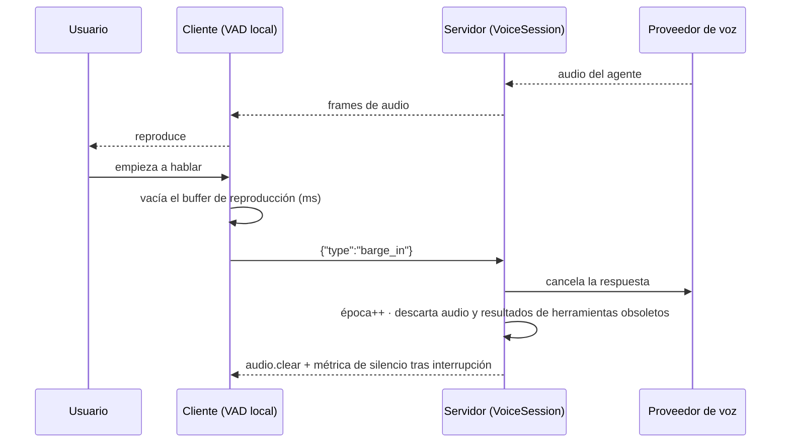

# OmniVoice Agent

**Plataforma de agentes de voz en tiempo real**: streaming de audio bidireccional por WebSocket, interrupción por voz (*barge-in*) con corte local inmediato, ejecución segura de herramientas con datos reales, aislamiento multi-tenant a nivel de base de datos y observabilidad de extremo a extremo.

[](https://github.com/Santidelacarrera/omnivoice-agent/actions/workflows/ci.yml)


> **Problema que resuelve.** En atención al cliente, soporte técnico y agendamiento, los pipelines en cascada
> (audio → texto → LLM → texto → audio) acumulan latencia y no permiten interrumpir al agente. OmniVoice mantiene una
> conexión dúplex con un proveedor de voz en tiempo real y orquesta en paralelo las llamadas a herramientas
> (consultar una reserva, comprobar stock, abrir un ticket) sin que el modelo toque nunca la base de datos.

---

## Contenido

1. [Arquitectura](#arquitectura)
2. [Arranque rápido](#arranque-rápido)
3. [Barge-in en dos niveles](#barge-in-en-dos-niveles)
4. [Protocolo de audio](#protocolo-de-audio)
5. [Herramientas seguras](#herramientas-seguras)
6. [Seguridad y multi-tenancy](#seguridad-y-multi-tenancy)
7. [Observabilidad](#observabilidad)
8. [API](#api)
9. [Configuración](#configuración)
10. [Pruebas, CI y rendimiento](#pruebas-ci-y-rendimiento)
11. [Estructura del repositorio](#estructura-del-repositorio)
12. [Estado real y limitaciones](#estado-real-y-limitaciones)
13. [Hoja de ruta](#hoja-de-ruta)

---

## Arquitectura

```mermaid
flowchart LR
  subgraph Browser["Navegador (Next.js + Tailwind)"]
    MIC[Micrófono] --> CAP[AudioWorklet de captura<br/>VAD local]
    PLAY[AudioWorklet de reproducción<br/>buffer vaciable] --> SPK[Altavoz]
  end

  subgraph API["Backend (FastAPI + asyncio)"]
    WS["/ws/audio"] --> VS[VoiceSession<br/>máquina de estados]
    VS --> PROV[RealtimeProvider<br/>OpenAI Realtime | Fake]
    VS --> TR[ToolRegistry<br/>validación · permisos · timeout · idempotencia]
    VS --> MET[Métricas<br/>Prometheus + p50/p95/p99]
  end

  CAP -- "PCM16 24 kHz · frames 20 ms" --> WS
  WS -- "audio del agente · eventos" --> PLAY
  PROV <--> OAI[(Proveedor de voz)]
  TR --> PG[(PostgreSQL<br/>RLS por organización)]
  VS --> PG
  API --> RD[(Redis<br/>tickets · rate limit · cupos)]
  MET --> PROM[Prometheus] --> GRAF[Grafana]
```

El navegador captura audio con un `AudioWorklet`, lo envía en frames de 20 ms y reproduce el audio del agente desde un
buffer propio que puede **vaciarse al instante**. El backend mantiene una sesión por conversación con una máquina de
estados explícita (`IDLE → LISTENING → PROCESSING → RESPONDING ⇄ TOOL_RUNNING → INTERRUPTED → COMPLETED | ERROR`)
y delega la voz en un proveedor intercambiable. Las decisiones de diseño están razonadas en
[`docs/ARCHITECTURE.md`](docs/ARCHITECTURE.md) (ADR-1 a ADR-6).

## Arranque rápido

```bash
cp .env.example .env          # Windows: copy .env.example .env
# edita .env: JWT_SECRET (openssl rand -hex 32) y, opcionalmente, OPENAI_API_KEY
docker compose up --build
```

Sin `OPENAI_API_KEY` se usa un **proveedor simulado**, suficiente para ver la interfaz, las herramientas y las métricas.
La clave real va **solo en `.env`** (ignorado por Git), nunca en `.env.example`.

| Qué | Dónde |
|---|---|
| Conversación en vivo | http://localhost:3000/conversation |
| Panel, agentes, historial, configuración | `/dashboard` · `/agents` · `/history` · `/settings` |
| API + OpenAPI | http://localhost:8010/docs (puerto configurable con `BACKEND_PORT`) |
| Métricas Prometheus / Grafana | `:8010/metrics` · `:9090` · `:3001` |

`docker compose` levanta PostgreSQL (aplicando las migraciones `001`–`003`), Redis, backend, frontend, Prometheus y
Grafana, todos con *healthchecks*.

**Sin Docker (modo memoria):**

```bash
cd backend && pip install -r requirements.txt
PERSISTENCE_BACKEND=memory STATE_BACKEND=memory uvicorn app.main:app --reload
cd frontend && npm install && npm run dev
```

## Barge-in en dos niveles

Interrumpir a un agente de voz exige cortar el audio **donde ya está**: en el buffer del navegador, no solo en el servidor.



- **Nivel 1 – cliente:** el VAD del `AudioWorklet` detecta voz y vacía el buffer sin esperar a la red.
- **Nivel 2 – servidor:** cancela al proveedor, incrementa la *época* de la sesión y descarta cualquier audio o resultado
  de herramienta de la respuesta anterior, para que nada «resucite» después de interrumpir.

## Protocolo de audio

| Dirección | Formato |
|---|---|
| Audio (ambos sentidos) | binario: `[seq u32 big-endian][PCM16 24 kHz mono]`, frames de 20 ms |
| Cliente → servidor (texto) | `barge_in`, `end` |
| Servidor → cliente (texto) | `session.ready`, `audio.clear`, `transcript_user`, `transcript_agent`, `tool.start`, `tool.end`, `metrics`, `state`, `error` |

El número de secuencia permite **detectar paquetes perdidos** y exponerlos como métrica. Códigos de cierre:
`4401` no autorizado · `4429` capacidad · `4408` tiempo de espera (inactividad de 60 s).

## Herramientas seguras

El modelo **propone**, el backend **dispone**. Cada llamada atraviesa, en orden: herramienta permitida para el agente →
permiso del rol → validación Pydantic con `extra="forbid"` → timeout → ejecución filtrada por organización → resultado
real devuelto al modelo. Las escrituras son idempotentes por `(org, call_id, tool)`.

| Herramienta | Tipo | Descripción |
|---|---|---|
| `check_inventory` | lectura | Stock de un producto |
| `check_reservation` | lectura | Estado de una reserva |
| `create_reservation` | escritura idempotente | Crea una reserva |
| `create_support_ticket` | escritura idempotente | Abre un ticket de soporte |
| `search_knowledge_base` | lectura | Búsqueda en la base de conocimiento |
| `transfer_to_human` | escritura | Encola una solicitud de transferencia (no conecta con un operador) |

## Seguridad y multi-tenancy

- **Aislamiento a nivel de BD:** cada transacción fija `app.org_id` con `set_config(..., true)` y las tablas llevan
  políticas RLS `FORCE`. La aplicación usa el rol `omni_app` (sin superusuario, `NOBYPASSRLS`): un `WHERE org_id`
  olvidado no filtra datos entre organizaciones. El CI lo comprueba contra un PostgreSQL real.
- **Mínimo privilegio:** `omni_app` no puede leer `users.password_hash` ni las membresías; `audit_logs` es append-only.
- **Autenticación:** JWT con roles (`admin`, `operator`, `customer`). El JWT **nunca** va en la URL del WebSocket: se
  canjea por un ticket de 30 s de un solo uso (`GETDEL` atómico en Redis).
- **Límites:** rate limiting por organización, cupo de sesiones (script Lua atómico con recuperación de cupos huérfanos),
  tamaño máximo de frame, inactividad y duración máxima de sesión.
- **Configuración defensiva:** en `production` el proceso **se niega a arrancar** sin `JWT_SECRET` ≥ 32 caracteres,
  PostgreSQL y Redis, o con CORS `*`. El endpoint `dev-token` solo existe fuera de producción.
- **Privacidad:** no se guardan los argumentos de las herramientas, solo sus claves; el audio no se persiste.
- Cabeceras de seguridad HTTP y Dependabot semanal (solo versiones menores y parches).

## Observabilidad

- **Logs JSON** con `request_id` (HTTP) y `correlation_id` (sesión) para reconstruir una conversación concreta.
- **Prometheus:** primer audio (TTFB), silencio tras interrupción, paquetes perdidos, duración y errores de herramientas,
  sesiones activas, errores por tipo.
- **Percentiles** p50/p95/p99 en `GET /api/v1/metrics` (por proceso; entre réplicas, usa los histogramas).
- **Sondas:** `/healthz` (liveness) y `/readyz` (comprueba BD y Redis). Alertas sugeridas en [`docs/RUNBOOK.md`](docs/RUNBOOK.md).

## API

| Método y ruta | Descripción |
|---|---|
| `POST /api/v1/sessions` | Crea la sesión (rate limit + cupo) |
| `POST /api/v1/sessions/{id}/connect` | Ticket de WebSocket de un solo uso + parámetros de audio |
| `WS /ws/audio?ticket=` | Streaming de audio y eventos |
| `GET /api/v1/conversations[/{id}]` | Historial y detalle con transcripciones |
| `GET/POST /api/v1/agents` | Agentes y sus herramientas permitidas |
| `GET /api/v1/metrics` | Percentiles de latencia |
| `GET /api/v1/audit-logs` | Auditoría (solo `admin`) |
| `POST /api/v1/auth/dev-token` | Token de desarrollo (solo fuera de producción) |
| `GET /healthz` · `/readyz` · `/metrics` | Sondas y Prometheus |

Documentación interactiva en `/docs` (OpenAPI).

## Configuración

Ver [`.env.example`](.env.example). Variables principales:

| Variable | Valor por defecto | Notas |
|---|---|---|
| `ENVIRONMENT` | `development` | `production` activa las comprobaciones de arranque |
| `PERSISTENCE_BACKEND` / `STATE_BACKEND` | `postgres` / `redis` | `memory` para desarrollo sin servicios |
| `JWT_SECRET` | *(placeholder)* | ≥ 32 caracteres en producción |
| `OPENAI_API_KEY` | vacío | vacío = proveedor simulado |
| `DATABASE_URL` | rol `omni_app` | debe ser un rol **sin** superusuario |
| `MAX_SESSIONS_PER_ORG` | `50` | cupo por organización |
| `RATE_LIMIT_SESSIONS_PER_MIN` / `RATE_LIMIT_API_PER_MIN` | `20` / `240` | ventana fija |
| `MAX_SESSION_SECONDS` | `1800` | duración máxima de una sesión |

## Pruebas, CI y rendimiento

```bash
cd backend && pytest -q                                   # unitarias, servicios, API y WebSocket
python -m bench.orchestrator_bench --sessions 200         # overhead del orquestador (sin red)
python -m bench.loadtest --url http://localhost:8010 --clients 50 --duration 20   # extremo a extremo
cd ../frontend && npm run typecheck && npm run build
```

El workflow [`ci.yml`](.github/workflows/ci.yml) ejecuta tres jobs:

| Job | Qué comprueba |
|---|---|
| `backend` | `pytest` + benchmark de humo del orquestador |
| `migrations` | aplica `001`–`003` sobre PostgreSQL 16, verifica que `omni_app` no es superusuario y que **RLS aísla organizaciones** |
| `frontend` | `typecheck` y `build` de Next.js |

**Medición disponible:** con 200 sesiones simultáneas, el orquestador aislado (sin red ni proveedor) resolvió el
barge-in en el servidor en el orden de microsegundos (p50 ≈ 2 µs, p95 ≈ 5 µs). Es el coste de **nuestro** código; la
latencia real depende del proveedor y de la red, y se mide con `bench/loadtest.py` en tu infraestructura.

## Estructura del repositorio

```
backend/      FastAPI: orchestration/ (sesión, estados) · realtime/ (proveedores, VAD) · tools/ (registro, handlers)
              security/ · services/ (persistencia, estado) · database/ · observability/ · tests/ · bench/
frontend/     Next.js: app/ (conversation, dashboard, agents, history, settings) · lib/ · public/worklets/
migrations/   001 esquema + RLS · 002 rol de aplicación · 003 conocimiento y datos demo
infrastructure/  prometheus.yml
docs/         ARCHITECTURE.md (ADR) · RUNBOOK.md (despliegue, alertas, incidentes)
```

## Estado real y limitaciones

Conviene saber qué está verificado y qué no:

- **Verificado:** pruebas del backend y compilación del frontend en CI; migraciones y aislamiento por RLS sobre
  PostgreSQL real en CI.
- **No verificado aún:** los nombres de eventos del adaptador **OpenAI Realtime** frente a la versión vigente de la
  API (no se probó contra el servicio real); los objetivos de latencia (p50 < 500 ms, barge-in p95 < 200 ms) son
  **metas** a validar con `bench/loadtest.py`.
- **No implementado:** purga automática por `retention_days` (ver runbook), SSO y gestión de usuarios (el JWT lo emite
  tu proveedor de identidad), telefonía, grabación de audio, transferencia efectiva a un operador humano, selector de
  voz e idioma en la UI.
- El VAD es por energía: en entornos ruidosos conviene uno basado en modelo (Silero, WebRTC VAD).
- El rate limiter es de ventana fija (ráfagas de hasta 2× en el cambio de ventana).

## Hoja de ruta

- [ ] Contrastar el adaptador de OpenAI Realtime con la API vigente y añadir pruebas de contrato
- [ ] Medir y publicar p50/p95 extremo a extremo con carga real
- [ ] Job de purga por `retention_days`
- [ ] VAD basado en modelo
- [ ] Transferencia real a operador humano y telefonía (SIP)
- [ ] Grabación opcional con consentimiento y almacenamiento de objetos
- [ ] Selector de voz e idioma; migración a Next 16 y Tailwind 4 (PR en revisión)

---

Documentación: [`docs/ARCHITECTURE.md`](docs/ARCHITECTURE.md) · [`docs/RUNBOOK.md`](docs/RUNBOOK.md)
