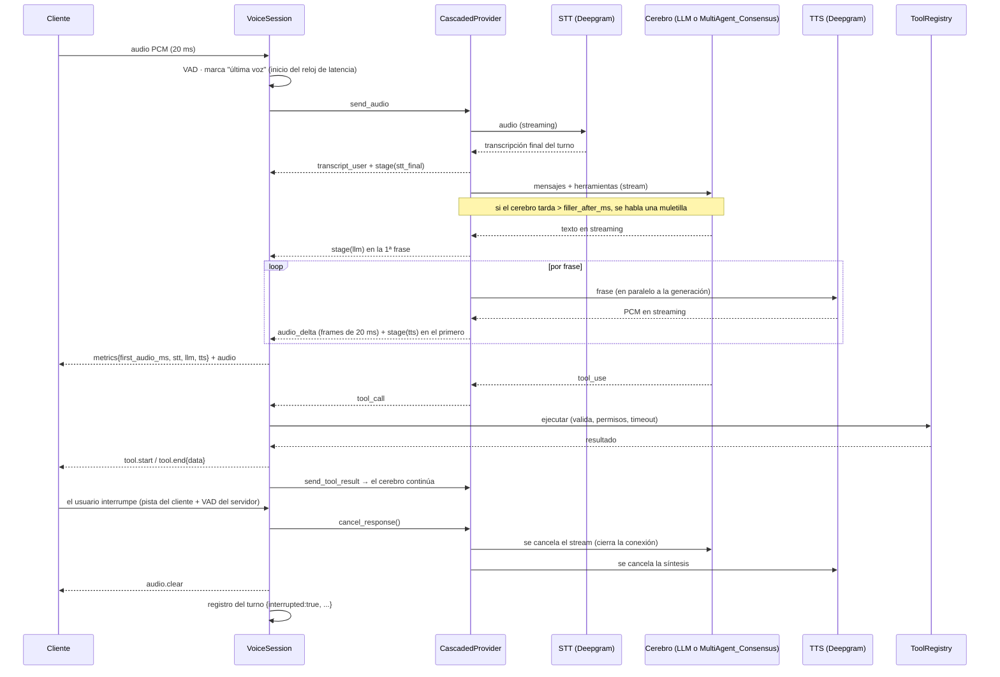

# Arquitectura de voz: streams, STT/TTS, cerebro de agentes y calidad

Documento de diseño del componente **omnivoice-agent** dentro del ecosistema. Marca qué está **implementado y probado** (✅), qué es un
**contrato propuesto** que otro componente debe cumplir (📐) y qué está **pendiente** (⏳).

## 1. Módulos

```
cliente (navegador / teléfono)
   │  PCM16 24 kHz, frames 20 ms  ⇄  eventos JSON            ✅ frontend/, app/telephony/
   ▼
Transporte        app/main.py (/ws/audio) · app/telephony/     auth por ticket, límites, cierre ordenado
   ▼
Sesión            app/orchestration/session.py (VoiceSession)  máquina de estados, VAD, barge-in, época, herramientas,
                                                              reconexión, registro por turno, coste
   ▼  contrato RealtimeProvider (connect · send_audio · events · cancel_response · send_tool_result · close)
Proveedor         app/realtime/
   ├─ cascade.py  CascadedProvider = STT ─▶ Cerebro ─▶ TTS       ✅ medición por etapa
   │      ├─ DeepgramSTT (WS streaming, reconexión interna)
   │      ├─ Cerebro (LLMClient): AnthropicLLM  |  ConsensusBrainLLM → MultiAgent_Consensus (📐)
   │      └─ DeepgramTTS (HTTP streaming)
   └─ gemini.py / provider.py  voz-a-voz (sin etapas separables)
   ▼
Herramientas      app/tools/ (registro: permisos, validación, timeout, idempotencia)  ✅ el cerebro propone, el backend ejecuta
Observabilidad    app/observability/metrics.py (Prometheus + percentiles) · registro de turnos en BD   ✅
```
Regla de diseño: **la sesión no sabe qué hay detrás del proveedor** y el proveedor en cascada no sabe qué hay detrás del cerebro. Cambiar de STT, TTS o de LLM
a un orquestador multiagente es cambiar un cliente, no la sesión.

## 2. Flujo de eventos asíncronos (un turno con interrupción)



**Concurrencia por sesión:** una tarea de recepción de audio (WebSocket), una de eventos del proveedor, y por turno un `TaskGroup` con productor
(cerebro → frases) y consumidor (frases → TTS → audio) más el temporizador de muletilla. Toda tarea nace de `_spawn` o del `TaskGroup`; `close()` las
cancela y no deja huérfanas (tests). El **barge-in** incrementa la *época*: audio y resultados de herramientas de épocas anteriores se descartan.

## 3. Latencia: dónde está cada milisegundo
`primer audio = endpointing STT + STT + cerebro (hasta 1ª frase) + TTS (hasta 1er audio)`, medido desde el **último chunk con voz** (ver `LATENCY.md`).
Palancas, por orden de impacto esperado: (1) sintetizar por frases mientras el cerebro genera (✅); (2) acortar el endpointing (compromiso: cortar al usuario en pausas);
(3) **el cerebro**: un consenso multiagente suma varias inferencias, así que solo es viable con (a) muletilla hablada (✅, `FILLER_AFTER_MS`), (b) un camino rápido de un
solo agente para turnos simples y consenso solo para decisiones (📐, decisión del orquestador), (c) que emita la respuesta en streaming en cuanto esté decidida.

## 4. Conexión con `MultiAgent_Consensus` (📐 contrato propuesto)
No existe en este repositorio ni conozco su interfaz; `ConsensusBrainLLM` implementa **este contrato**, que el orquestador debe exponer (o se adapta el cliente):

`POST {BRAIN_URL}` (`Authorization: Bearer {BRAIN_API_KEY}`) con `{system, messages, tools, max_tokens}`; respuesta **NDJSON** en streaming, un evento por línea:

| Evento | Significado |
|---|---|
| `{"type":"text","text":"…"}` | fragmento de la **respuesta ya acordada** (lo que se habla; nunca deliberaciones internas) |
| `{"type":"tool_use","id","name","input"}` | herramienta que debe ejecutar **omnivoice** (el consenso propone, el backend dispone) |
| `{"type":"usage","in":N,"out":M}` | tokens agregados de todos los agentes (alimenta el coste/min) |
| `{"type":"progress",…}` | opcional; se ignora en el audio |

Garantías necesarias del lado del orquestador: cancelación al cerrar la conexión (barge-in), idempotencia por turno, y sin estado oculto del que dependa la voz.
Activación: `BRAIN_URL=https://…` (con `DEEPGRAM_API_KEY`); sin ella se usa el LLM directo. Los mensajes llevan solo texto y bloques de herramienta: **el audio nunca sale de omnivoice**.

## 5. Monitoreo de calidad de la conversación
| Señal | Estado | Dónde |
|---|---|---|
| Latencia por turno (total y STT/LLM/TTS) | ✅ | evento `turn` por turno, `omnivoice_first_audio_seconds`, `omnivoice_stage_seconds{stage}` |
| Interrupciones | ✅ | `turn.interrupted`, `omnivoice_turns_total{outcome}`, silencio tras interrupción (`omnivoice_barge_in_seconds`) |
| Herramientas por turno y errores | ✅ | `turn.tools`, `omnivoice_tool_seconds` |
| Paquetes perdidos, reconexiones, errores | ✅ | `omnivoice_packets_lost_total`, `omnivoice_provider_reconnects_total`, `omnivoice_errors_total` |
| Coste por minuto | ✅ | `docs/COSTS.md` |
| **Claridad de la interacción** | ⏳ propuesta | Sin evaluar contenido no hay una cifra honesta. Candidatos baratos: confianza media del STT por turno (Deepgram la devuelve; no se recoge aún), tasa de interrupciones por turno (ya), turnos del usuario que repiten al anterior (requiere comparar transcripciones: política de privacidad explícita antes), abandono antes del primer audio. |

El registro de turno guarda **solo cifras** (sin texto ni audio), coherente con la política de logs; las transcripciones siguen su propia retención.

## 6. Qué falta para dar por cerrado este diseño
1. Confirmar con el equipo de `MultiAgent_Consensus` el contrato de la sección 4 (o ajustar `ConsensusBrainLLM`).
2. Medir con servicios reales (`bench/run_real.sh`) y, con el consenso, decidir si hace falta el camino rápido de un solo agente.
3. Elegir y aprobar la métrica de claridad (sección 5).
